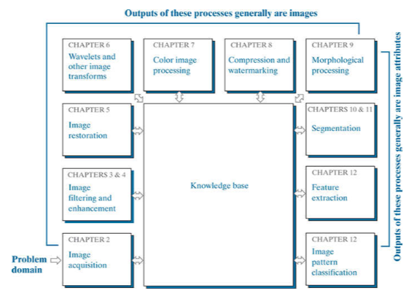

# 数字图像处理

在书中将DIP分为两个主要类别：
1. 输入和输出都是图像；
2. 输入可能是图像但输出是从这些图像中提取的属性；

数字图像处理的基本步骤：

- 通常图像获取阶段包括图像预处理，譬如图像缩放。
- **图像增强**是对一幅图像进行某种操作，使其结果在特定应用中比原始图像更适合进行处理。图像增强通常就是建立在面向问题的基础之上的。
- **图像复原**也是改进图像外观的一个处理领域，不过与图像增强不同，图像增强是主观的，而图像复原是客观的；从某种意义上说，复原技术倾向于以图像退化的数学或概率模型为基础。
- **小波**是不同程度分辨率的图像表示的基础，常用于图像数据压缩和金字塔表示，
- **彩色图像处理**
- **压缩**：是指减少图像储存量或降低传输图像带宽的处理。
- **形态学处理**：涉及提取图像分量的工具，这些分量在表示和描述形状方面很有用。
- **分割过程**：将一幅图像划分为它的组成部分或目标。通常，自动分割是数字图像处理中最困难的任务之一。成功的把目标逐一识别出来是一个艰难的分割过程。通常，分割越准确，识别越成功。**描述**又被称为特征选择，涉及提取特征，它可得到某种感兴趣的定量信息，或是区分一组目标与其他目标的基础。
- **识别**是基于目标的描述给该目标赋予标志（如：车辆）的过程。

感知由两个部件来获取：第一个部件是物理设备，需要对我们希望成像的目标辐射的能量很敏感。第二个部件称为数字化器，是一种吧物理感知装置的输出转换为数字形式的设备。

专用图像处理硬件通常由数字化器与执行其他原始操作的硬件，如ALU组成，算术逻辑单元对整个图像并行执行算术与逻辑运算。ALU有时也被称为前端子系统，其显著的特点是速度快。

图像处理应用的数字存储分为3个主要的类别：
1. 处理期间的短期存储：例如计算机内存，或者是采样专用的存储板，这种存储板称为帧缓存，它们可以存储一帧图像，并可以快速访问，通常以视频速率（30帧/秒）访问；其中帧缓存允许瞬时缩放、滚动、平移；
2. 关系到快速调用的在线存储：通常采用磁盘或光介质存储；
3. 档案存储，其特点是不频繁访问：磁带或光盘；

锥状体视觉称为白昼视觉或者是亮视觉。杆状体用来给出视野内的一般总体图像，它们没有彩色感觉，对低照明度敏感，例如在白天呈现鲜明色彩的物体，在月光下都没有颜色，这是因为只有杆状体受到刺激，这种现象称为暗视觉或者微观视觉。

在普通照相机中，镜头有固定的焦距，各种距离的聚焦是通过改变箭头与成像平面键的距离实现的，胶片放置在成像平面上。在人眼中，与此相反，晶状体和成像区域之间的距离是固定的，实现正确聚焦的焦距是通过改变晶状体的形状来得到的。

#### 亮度适应和辨别

人的视觉系统能够适应的光强度级别分为很宽——从暗阈值到强光越有10^10^ 个数量级。实验数据表明：主观亮度（即由人的视觉系统感知的亮度）是进入人眼的光强的对数函数。

眼睛可以同时辨别的不同强度级别的总范围与整个适应范围相比是很小的。对于任何给定的条件集合，视觉系统的当前灵敏度级别称为亮度适应级别。

除了频率之外，我们还用3个基本量来描述彩色光源的质量：发光强度、光通量和亮度。

发光强度是从光源流出的能量总数，通常用瓦特(W)来度量。流明数(lm)度量的光通量给出了观察者从光源感受到的能量。例如：从远红外光谱分为的光源发射出的光具有实际意义的能量，但观察者却很难感知到它，其光通量几乎是 0lm。亮度是光感知的一个主观描绘子，它实际上不能度量，它具体体现了强度的无色概念，是描述彩色感觉的参数之一。
