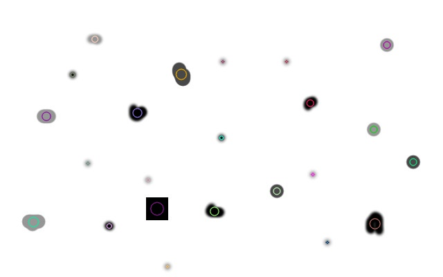
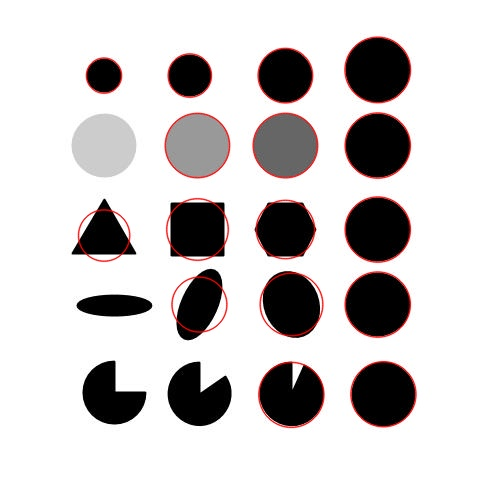

# opencv 斑点检测

> 英文地址：<https://www.learnopencv.com/blob-detection-using-opencv-python-c/> <br>本文对其进行了翻译，并就其中的概念添加了说明，转载请说明出处。



## 何谓斑点(Blob)

斑点从计算机的角度来看，是在一幅图片中相互连接的像素点一组像素点，它们彼此之间有着相似的属性（例如灰度值）。在上面的图中，黑色连通的区域就是一个个斑点，斑点检测就是将这些区域识别并标注出来。

> The most common method for blob detection is convolution. 《摘自维基百科 [Blob detection](https://en.wikipedia.org/wiki/Blob_detection)》

## 斑点检测 - 简单版

opencv 提供了一组接口，我们可以方便的进行斑点检测，并可以通过斑点的不同特征设置过滤。下面是一个示例代码。
原图片为：

**Python**
```python
import cv2
import numpy as np

im = cv2.imread('./src/blob.jpg', cv2.IMREAD_GRAYSCALE)

# 使用默认参数创建检测器
# opencv 2.x 版本使用
# detector = cv2.SimpleBlobDetector()
# opencv 3.x 或 4.x 版本使用
detector = cv2.SimpleBlobDetector_create()

keypoints = detector.detect(im)

# 将检测到的斑点用红色圆圈标注
# cv2.DRAW_MATCHES_FLAGS_DRAW_RICH_KEYPOINTS 保证了圆圈能够和斑点相匹配
im_with_keypoints = cv2.drawKeypoints(im,keypoints, np.array([]), (0,0,255),
                                     cv2.DRAW_MATCHES_FLAGS_DRAW_RICH_KEYPOINTS)

cv2.imwrite("./src/blob_detected.jpg", im_with_keypoints)
```


## 斑点检测的工作原理

`SimpleBlobDetector_create`，类如其名，使用的是非常简单的算法。该算法若干的参数(用黑体表示)进行控制，算法结果以下步骤：
- **阈值分割(thresholding)**：通过阈值将源图片转换为若干张二值图像。最小阈值为: **minThreshold**，并且阈值不会超过 **maxThreshold**，每两个阈值之间的步进位 **thresholdStep**，因此:
    - 第一张图的阈值为 **minThreshold**
    - 第二张图的阈值为 **minThreshold** + **thresholdStep** × 1
    - 第三张图的阈值为 **minThreshold** + **thresholdStep** × 2
    - ……
- **分组(grouping)**：在每一张二值图片中，相互连通的白色像素组在一起，我们称之为二值斑点；
- **合并(merging)**：计算出每个二值斑点在二值图中的中心位置，并将距离小于 **minDistBetweenBlobs** 的斑点合并；
- **中心与半径计算(center & radius calculation)**：计算中心位置与半径并作为返回值返回；

## 通过颜色/大小/形状设置过滤器

我们可以通过对 `SimpleBlobDetector` 设置过滤器得到我们需要的斑点：

- 通过颜色过滤：实现设置 **filterByColor**=1，然后设置 **blobColor**=0
